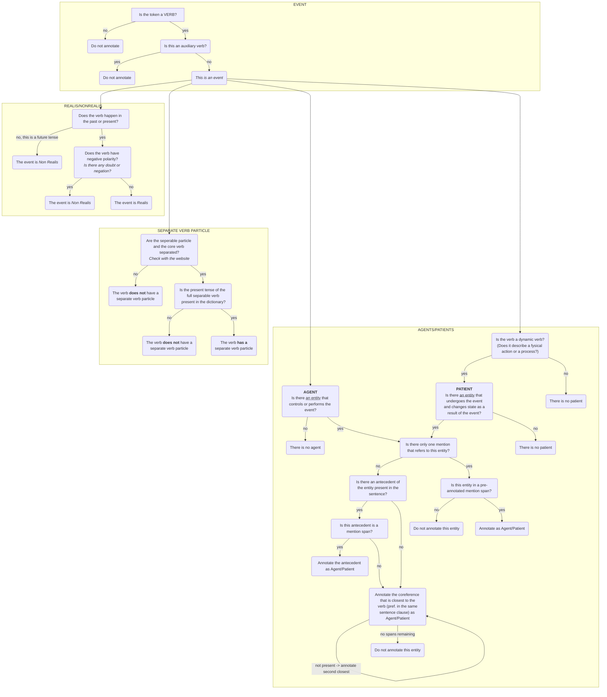

# Annotation Flowchart

```mermaid
flowchart TD
    subgraph one [EVENT]
    VERB[Is the token a VERB?] 
    VERB -->|no| _0(Do not annotate)
    VERB -->|yes| MAIN-VERB
    
    MAIN-VERB(Is this an auxiliary verb?)
    MAIN-VERB --> |yes| _1(Do not annotate)
    MAIN-VERB --> |no| EVENT(<i>This is an event</i>)
    end

    EVENT --> REALIS
    EVENT -----> SEP-VERB-PRTCL
    EVENT --------> AGENT
    EVENT -------> DYNAMIC

    subgraph two [REALIS/NONREALIS]
    REALIS(Does the verb happen in the past or present?)
    REALIS --> |no, this is a future tense| NON-REALIS0(The event is <i>Non Realis<i>)
    REALIS --> |yes| POLARITY
    
    POLARITY(Does the verb have negative polarity?\n<i>Is there any doubt or negation?</i>)
    POLARITY --> |yes| NON-REALIS(The event is <i>Non Realis<i>)
    POLARITY --> |no| REALIS_(The event is <i>Realis</i>)
    end

    subgraph three [SEPARATE VERB PARTICLE]
    SEP-VERB-PRTCL(Are the seperable particle and the core verb separated?\n<i>Check with the website</i>)
    SEP-VERB-PRTCL --> |no| NO-PRTCL0(The verb <b>does not</b> have a\n separate verb particle)
    SEP-VERB-PRTCL --> |yes| PRTCL-DICT
    
    PRTCL-DICT(Is the present tense of the full separable verb\n present in the dictionary?)
    PRTCL-DICT --> |no| NO-PRTCL1(The verb <b>does not</b> have a\n separate verb particle)
    PRTCL-DICT --> |yes| PRTCL(The verb <b>has a</b>\n separate verb particle)
    end

    subgraph four [AGENTS/PATIENTS]
    AGENT(<b>AGENT</b>\nIs there <u>an entity</u> that \ncontrols or performs the event?)
    AGENT --> |no| NO-AGENT0(There is no agent)
    AGENT --> |yes| SPAN-AMOUNT

    SPAN-AMOUNT(Is there only one mention that refers to this entity?)
    SPAN-AMOUNT --> |no| ANTECEDENT
    SPAN-AMOUNT --> |yes| MENTION-SPAN0
    
    MENTION-SPAN0(Is this entity in a pre-annotated mention span?)
    MENTION-SPAN0 --> |no| NO-SPAN0(Do not annotate this entity)
    MENTION-SPAN0 --> |yes| AGENT0(Annotate as Agent/Patient)

    ANTECEDENT(Is there an antecedent of\n the entity present in the sentence?)
    ANTECEDENT --> |yes| MENTION-SPAN1
    ANTECEDENT --> |no| MENTION-SPAN2

    MENTION-SPAN1(Is this antecedent is a mention span?)
    MENTION-SPAN1 --> |yes| AGENT1(Annotate the antecedent as Agent/Patient)
    MENTION-SPAN1 ---> |no| MENTION-SPAN2
    
    MENTION-SPAN2("Annotate the coreference that is closest to the\n verb (pref. in the same sentence clause) as Agent/Patient")
    MENTION-SPAN2 --> |not present -> annotate second closest| MENTION-SPAN2
    MENTION-SPAN2 --> |no spans remaining| NO-SPAN1(Do not annotate this entity)
 

    DYNAMIC("Is the verb a dynamic verb?\n(Does it describe a fysical action or a process?)")
    DYNAMIC --> |yes| PATIENT
    DYNAMIC --> |no| STATIVE("There is no patient")


    PATIENT(<b>PATIENT</b>\nIs there <u>an entity</u> that undergoes the event\n and changes state as a result of the event?)
    PATIENT --> |yes| SPAN-AMOUNT
    PATIENT --> |no| NO-PATIENT(There is no patient)
    end

```

This is the [separate verb particle online dictionary](https://anw.ivdnt.org/search)